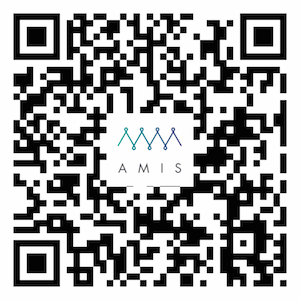

class: center, middle

# Ethereum Smart Contract
## Yu-Te Lin

---
## About me
- VP of Engineering, Amis
- Director of Engineering, MaiCoin
- Manager, HTC
- Co-founder, Everyday.me (Y-Combinator backed)
- Engineer, Oracle/Dell (Wyse)
- MS Stanford, BS NCCU

---

## 以太坊開發環境及工具介紹
- Ethereum and Smart contract
- Wallet GUI: Mist, MetaMask
- Command line tools: geth, solc
- Contract deployment
---

## 以太坊智能合約開發
- 程式設計
- 資訊安全
- 設計模式
- 測試
---

## Dapps 開發
- Dapp 範例 - FlightDelay
- Web3 JavaScript Ðapp API
- 開發工具 - Meteor

---

## Github
- Github: https://github.com/amisamity/contract-training

