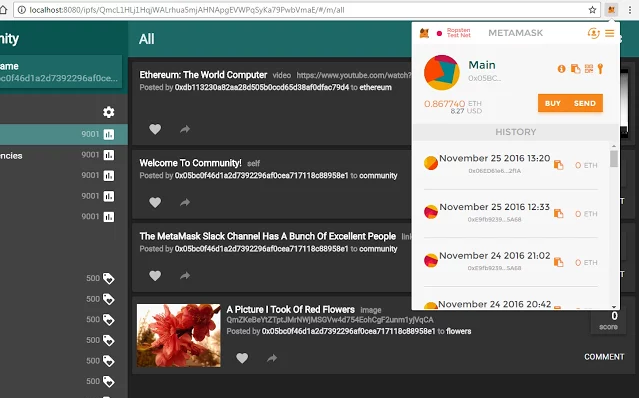
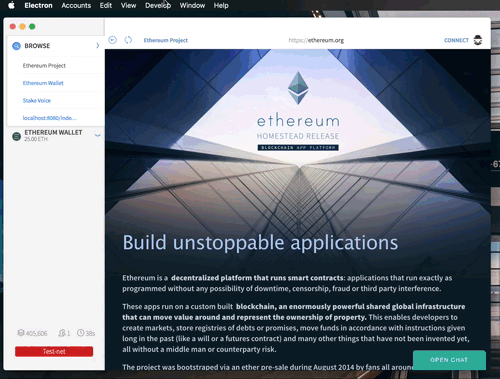

class: center, middle

# Ethereum Development Environment and Tools

---
## Ethereum and Smart Contract

- General purpose blockchain

- Ethereum: TCP/IP = Bitcoin: SMTP

- Smart contract: logic + data at a specific address

---
## Ethereum accounts

- External accounts: controlled by public-private key pairs (i.e. humans)
    - ether

- Contract accounts: controlled by the code stored together with the account.
    - ether
    - code (logic)
    - data (storage)

- EVM treats the two types equally

---
## Simple contract: OneValueContract
```Javascript
contract OneValue {
    uint256 value;

    function OneValue(uint256 initValue) {
        value = initValue;
    }

    function setValue(uint256 v) {
        value = v;
    }

    function getValue() constant returns (uint256 result){
        return value;
    }
}
```

---
## All in one wallet: Mist/Ethereum Wallet
- The Mist browser is the tool of choice to browse and use Ðapps (decentralized applications).

- Github: https://github.com/ethereum/mist

- Installable binaries: https://github.com/ethereum/mist/releases

---

## Ethereum wallet demo

- Network: mainnet and testnet

- Mining: testnet only (can still enable it via console)

- Wallets

- Send

- Contracts

---

## Mist / Ethereum data location

- Mist:
    - Windows:  `%APPDATA%\Mist`

    - Mac:  `~/Library/Application Support/Mist`

    - Linux: `~/.config/Mist`

- Ethereum:

    - Mac:  `~/Library/Ethereum`

---

## In browser wallet - MetaMask

- MetaMask: https://metamask.io/

- Chrome plugin: https://goo.gl/8uPYIA




---
## Geth

- Ethereum go implementation (Mist is actually using geth)
    - `ps -aef | grep geth`

- Install:
    - https://www.ethereum.org/cli

- Management API:
    - https://github.com/ethereum/go-ethereum/wiki/Management-APIs

- Javascript Console:
    - https://github.com/ethereum/go-ethereum/wiki/JavaScript-Console

---

## Run geth (mainnet)

```bash
geth --fast  \
    --datadir "~/.eth/mainnet"  \
    --rpc --rpccorsdomain "*"  \
    --ipcapi "admin,db,eth,debug,miner,net,shh,txpool,personal,web3"  \
    --rpcapi "db,eth,net,web3,personal"  \
    --rpcport "8547"  \
    --port "30305" \
    console
```

---

## Run geth (testnet)

```bash
geth --fast \
    --datadir "~/.eth/testnet"  \
    --ipcapi "admin,db,eth,debug,miner,net,shh,txpool,personal,web3"  \
    --rpc --rpccorsdomain "*"  \
    --rpcapi "db,eth,net,web3,personal"  \
    --rpcport "8546" \
    --port "30304" \
    --testnet \
    console
```

---

## Run geth (private chain)
option 1: use `networkid`

```bash
geth --fast \
    --datadir "~/.eth/privnet"  \
    --ipcapi "admin,db,eth,debug,miner,net,shh,txpool,personal,web3"  \
    --rpc --rpccorsdomain "*"  \
    --rpcapi "db,eth,net,web3,personal"  \
    --rpcport "8545" \
    --port "30303" \
    --networkid "12345" \
    --nodiscover \
    console
```

---

## Run geth (private chain)
option 2: use both `networkid` and custom `genesis.json`

Example genesis.json:

```JSON
{
  "nonce": "0x0000000000000042",
  "timestamp": "0x0",
  "parentHash": "0x0000000000000000000000000000000000000000000000000000000000000000",
  "extraData": "Any extra data 134ADFAD",
  "gasLimit": "0x47e7c4",
  "difficulty": "0x9c40",
  "mixhash": "0x0000000000000000000000000000000000000000000000000000000000000000",
  "coinbase": "0x3333333333333333333333333333333333333333",
  "alloc": {
    "0x60cafee22ae353ac9de07852a682558c9bb84e61": {
      "balance": "999999999999999999999999999999999"
    }
  }
}
```

---

## Run geth (private chain)
option 2: use both `networkid` and custom `genesis.json`, so we can avoid network id collision.

Init blockchain:
```bash
geth --datadir "~/.eth/privnet2"  \
    init "/PATH/TO/genesis.json"
```

Run:
```bash
geth --fast \
    --datadir "~/.eth/privnet2"  \
    --ipcapi "admin,db,eth,debug,miner,net,shh,txpool,personal,web3"  \
    --rpc --rpccorsdomain "*"  \
    --rpcapi "db,eth,net,web3,personal"  \
    --rpcport "8545" \
    --port "30303" \
    --networkid "12345" \
    --nodiscover \
    console
```

---
## Geth API

- IPC: Unix socket

    - Attach to Mist geth console:
    ```
    geth attach ipc:~/Library/Ethereum/geth.ipc
    ```

- RPC: HTTP API

- WebSocket

---
## Solidity compiler: solc

- solcjs

```bash
npm install solc -g
```

- solc: https://github.com/ethereum/solidity

```bash
git clone --recursive https://github.com/ethereum/solidity.git
cd solidity
mkdir build
cd build
cmake .. && make && make install
```

---
## Compile contract

- Browser-Solidity: https://ethereum.github.io/browser-solidity/

- solc

    ```
    solc --abi --bin --gas -o ./build OneValue.sol
    ```

---

## Solidity editor

- Atom: language-ethereum

- SublimeText: ethereum

- Visual Studio: Solidity

- Remix (formerly Mix) IDE https://github.com/ethereum/remix

---

## Mist demo - Remix IDE



---

## Libraries and development tools

- Web3: https://github.com/ethereum/web3.js

    This is the Ethereum compatible [JavaScript API](https://github.com/ethereum/wiki/wiki/JavaScript-API) which implements the [Generic JSON RPC](https://github.com/ethereum/wiki/wiki/JSON-RPC) spec.

- Testrpc: https://github.com/ethereumjs/testrpc

    Fast Ethereum RPC client for testing and development. (RPC mock)


- Truffle: https://github.com/ConsenSys/truffle

    Truffle is a development environment, testing framework and asset pipeline for Ethereum, aiming to make life as an Ethereum developer easier.

---
## Web3

- Install:

    `npm install web3`

- Enable rpc in console:

    `admin.startRPC("0.0.0.0", 8545, "*","db,eth,net,web3,personal")`

- Example code: `node web3-test.js`

    ```Javascript
    var Web3 = require('web3');
    var web3 = new Web3(
        new Web3.providers.HttpProvider("http://localhost:8545"));

    web3.eth.getBlock(48, function(error, result){
        if(!error)
            console.log(result)
        else
            console.error(error);
    });
    ```

---
## Testrpc

- Install:

    `npm install -g ethereumjs-testrpc`


- Run testrpc:

    `testrpc -p 8547`

- Connect with Web3: `node web3-testrpc.js`

    ```Javascript
    var Web3 = require('web3');
    var TestRPC = require("ethereumjs-testrpc");
    var web3 = new Web3(TestRPC.provider());
    web3.eth.getAccounts(function(e, accts){
        console.log("error:", e);
        console.log("accounts:", accts);
        process.exit(0);
    });
    ```

- NOTE: As of version 3.0.2, testrpc requires at least Node 6.9.1 to run - this is because the ethereumjs-vm@2.0.1 dependency is now shipping using ES2015 language features.

- Suggestion: using NVM [https://github.com/creationix/nvm](https://github.com/creationix/nvm)

---
## NVM
Node Version Manager - Simple bash script to manage multiple active node.js versions

- Install:

    https://github.com/creationix/nvm#installation

- Use nvm:
```
> cd js
> nvm use
```

---
## NVM (install 6.9.1)

- Install:
```
nvm install 6.9.1
```

- List installations:
```
nvm list
```

- Use:
```
nvm use 6.9.1
```

---
## Truffle
- Document: http://truffleframework.com/docs/

- Install:
    `npm install -g truffle`

- Init:
    `truffle init`

- Compile:
    `truffle compile`

- Deploy:
    `truffle migrate`

- Test:
    `truffle test`

---
## Truffle Dapp

- Default builder is no longer shipped with truffle from 3.*

- Install default builder:
    `npm install truffle-default-builder --save`

- Config `truffle.js`

- Build frontend:
    `truffle build`

- Run frontend:
    `truffle serve`

- Edit `truffle.js` to config rpc.

- Open dapp:
    `open http://localhost:8080`

---
## Contract deployment
- Mist

- Truffle

- Web3

---
## Deploy contract with Mist

- Contracts -> Deploy new contract -> Paste code and deploy

- Remix IDE -> Create

---
## Deploy contract with Truffle

- Update rpc setting in `truffle.js`

- Create contract: `truffle create:contract OneValue`

- Edit `OneValue.sol`

- Compile: `truffle compile`

- Add migration file: `3_deploy_one_value_contract.js`

- Deploy: `truffle migrate`

- Note: need to unlock account before deployment if you are using live network.

---
## Deploy contract with Web3

- Deploy to testrpc: `node deploy-contract-testrpc.js`

- Deploy to testnet: `node deploy-contract-test.js`

- Example code (partial):

    ```Javascript
    var abi  = ...
    var evmCode = ...
    var OneValueContract = web3.eth.contract(abi);
    var oneValue = OneValueContract.new(initValue,
        {from:addr, data: evmCode, gas: 4700000},
        function(error, contract){
            ...
        }
    );
    ```

---
## Mining

- In console:

    ```
    miner.start(1)
    ```

- In geth command:

    ```
    geth --mine --minerthread "4"
    ```

- In mist: (testnet only)

    - Develop -> Start Mining


---
## Interact with contract (Express + Web3)

- Example (partial):

```Javascript
var abi  = ... var OneValueContract = web3.eth.contract(abi);
var contractAddress = '0x36274a6286c9cf3c8e09c85c5bfa572a8827fddc'; //Testnet
var oneValue = OneValueContract.at(contractAddress);

app.get('/', function (req, res) {
  res.send(
      'OneValue Instance: ' + contractAddress + "\n" +
      'Value: '+ oneValue.getValue() + "\n");
});

app.listen(3000)
```

- Run: `node express-example.js`

- Test: `curl http://localhost:3000`
