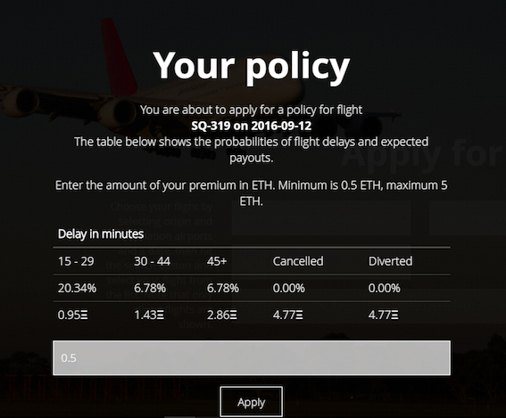
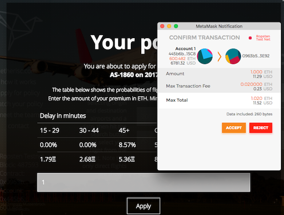
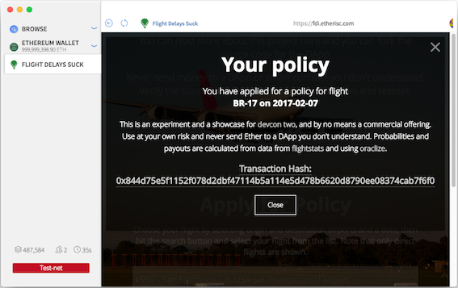

class: center, middle

# Insurance Examples - Flight Delay

---

## Blockchain to Disrupt Air Travel and Insurance with FlightDelay

- FlightDelay: https://fdd.etherisc.com/

- Github: https://github.com/etherisc/flightDelay

- Cryptocoins News article: https://www.cryptocoinsnews.com/blockchain-disrupt-air-travel-insurance-flightdelay/

---
## FlightDelay example from Cryptocoins News
- Picked a random flight and pay 0.5 ETH premium

- No delay: receive nothing

- Delay for 15 to 29 minutes (20.34%): receive 0.95 ETH

---
## FlightDelay DApp Demo - MetaMask
- MetaMask: https://metamask.io/

---
## FlightDelay DApp Demo - Mist
- Mist: https://github.com/ethereum/mist/releases

---

## FlightDelay code tracing

- Github: https://github.com/etherisc/flightDelay/blob/master/FlightDelay.sol

- Oraclize: https://github.com/oraclize/ethereum-api

    - Underwriting: flight delay probability

    - Payout: how much delay

- Flight Stats API: https://developer.flightstats.com/api-docs/
