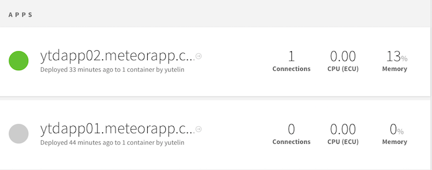

class: center, middle

# Dapps Development

---

## What are Dapps

- Dapps - decentralized applications

- Ethereum Dapps - applications interact with Ethereum blockchain

---

## Development environment

- Ethereum RPC: (Geth, Mist, MetaMask)

- Library: Web3

- Framework: Meteor, Truffle

    - We will focus on __Meteor__ in this lecture

    - For __Truffle__ please see [Ethereum Development Environment and Tools](https://amisamity.github.io/contract-training/slides/2_Ethereum_Development_Environment_and_Tools.md.html)

---

## Web3 API Connection

- Geth: ` admin.startRPC("0.0.0.0", 8545, "*","db,eth,net,web3,personal")`

    ```Javascript
    web3 = new Web3(new Web3.providers.HttpProvider('http://localhost:8545'));
    ```

- Mist: `http://localhost:3000/`

    Will be replaced with IpcProvider

    ```Javascript
    > web3.currentProvider
    > IpcProvider
    ```

- MetaMask: `http://localhost:3000/` in Chrome

    Will be replaced with MetamaskInpageProvider

    ```Javascript
    > web3.currentProvider
    > MetamaskInpageProvider
    ```

---

## Dapp example (Meteor): Ethereum Wallet

```
git clone git@github.com:ethereum/meteor-dapp-wallet.git
npm install  
cd meteor-dapp-wallet/app
meteor
```

- Client options:

    - Mist browser

    - Chrome with MetaMask

    - Browser with Geth RPC

---

## Meteor

Framework for building javascript apps.
https://www.meteor.com/

---

## Meteor - get started

- Install:

    `curl https://install.meteor.com/ | sh`

- Create app

    `meteor create myDapp`

- Install app packages

    `cd myDapp && npm install`

- Run

    `meteor`

---

## Meteor - add Libraries

- Required:

    ```
    meteor add ethereum:web3
    meteor add less
    meteor add ethereum:dapp-styles
    ```

- Optionals

    ```
    meteor add ethereum:tools
    meteor add ethereum:elements
    meteor add ethereum:accounts
    meteor add ethereum:blocks
    meteor add frozeman:template-var
    meteor add frozeman:persistent-minimongo2
    ```

---

## Meteor - file structure

- __client__ : loaded by the client. Most of our files go.

- __lib__: loaded before other files in the same folder.

- __public__: assets available on the root of the Dapp.

---

## Meteor - add web3 Library

```
mkdir lib
cd lib && touch init.js
```

Add following:

```Javascript
if(typeof web3 === 'undefined')
    web3 = new Web3(new Web3.providers.HttpProvider('http://localhost:8545'));
```

---

## Meteor - check web3 connection

Run meteor:

```
meteor
```

Open chrome:
    View -> Developer -> Javascript Console

```
web3.eth.accounts
```

---

## Meteor - styling

- rename main.css to main.less

- add following

    ```Javascript
    // libs
    @import '{ethereum:dapp-styles}/dapp-styles.less';

    ```

---

## Meteor - using ethereum packages (1/2)

In main.html:

- Add `{{> blockInfo}}` in `body` section.

- Add following in the end

    ```html
    <template name="blockInfo">
        <span>Block height: {{currentBlock}}</span>
    </template>
    ```

---

## Meteor - using ethereum packages (2/2)

In main.js:

```Javascript
Template.blockInfo.onCreated(function blockInfoOnCreated(){
    EthBlocks.init();
});

Template.blockInfo.helpers({
    currentBlock(){
        return EthBlocks.latest.number;
    },
});
```

---

## OneValue with Meteor - OneValue Contract

Deployed at: `0xe07438274839E9793baEAaa757F695CfED4A9e26`

```Javascript
pragma solidity ^0.4.4;

contract OneValue {
    uint256 value;

    function OneValue(uint256 initValue) {
        value = initValue;
    }

    function setValue(uint256 v) {
        value = v;
    }

    function getValue() constant returns (uint256 result) {
        return value;
    }
}
```

---

## OneValue with Meteor - interaction (1/2)

OneValue instance:

```Javascript
var abi = [{"constant":true,"inputs":[],"name":"getValue","outputs":[{"name":"result","type":"uint256"}],"type":"function"},{"constant":false,"inputs":[{"name":"v","type":"uint256"}],"name":"setValue","outputs":[],"type":"function"},{"inputs":[{"name":"initValue","type":"uint256"}],"type":"constructor"}];;
var OneValueContract = web3.eth.contract(abi);
this.contractAddress = '0xe07438274839E9793baEAaa757F695CfED4A9e26';
var oneValue = this.oneValue = OneValueContract.at(this.contractAddress);
```

---

## OneValue with Meteor - interaction (1/2)

Get value:
```Javascript
oneValue.getValue(function(err, res){
    currentValue.set(res.toNumber());
});
```

Set value:
```Javascript
oneValue.setValue.sendTransaction(_.toNumber(newValue), function(err, res){
    message.set("Transaction hash: " + res);
});
```

---

## Deployment - Meteor Galaxy

- Create account: https://galaxy.meteor.com/

- Pricing: starts from $0.04/ hour

- Deploy doc: http://galaxy-guide.meteor.com/

- Quick command: `meteor deploy <your_app_name>.meteorapp.com`

---

## Meteor galaxy dashboard


